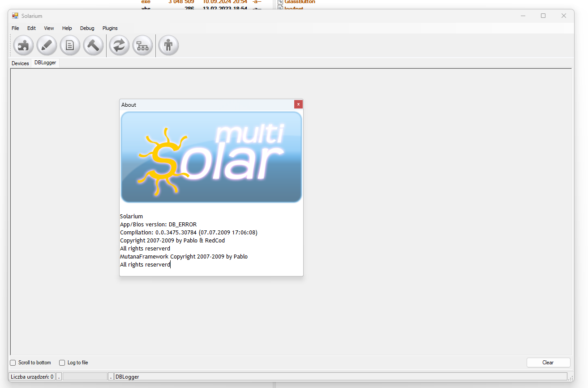
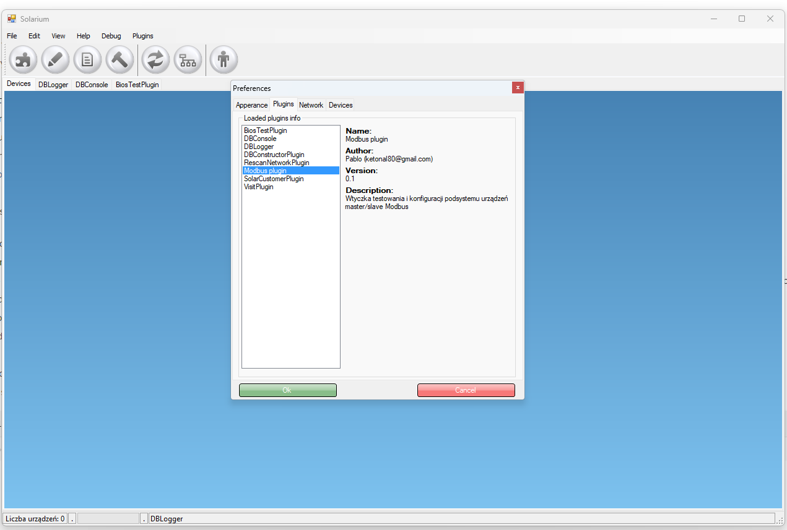

# Multi Solar [legacy code]

This is a legacy C# code for an application to run a solarium business (with beds controls via dedicated piece of hardware using modbus/RS485!). Written using SharpDevelop IDE.

Main code is in Solarium folder. Rest of folders are just a plugins for main app.

Unfortunately it wont work without the database and the real devices:(

So here are few screens:

